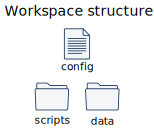

# Sinagot

Sinagot is a Python library to batch multiple **scripts** on a file-system **dataset** with a simple API.
Parallelization of data processing is made possible by [Dask.distributed](https://distributed.dask.org/en/latest/). 

## Installation

Sinagot is available on PyPi:

```bash
pip install sinagot
```

## Full Documentation

<https://sinagot.readthedocs.io>

## Concept

Sinagot main class is build around the `sinagot.Workspace` class. To create an instance, you must provide 3 pathes to :

- A configuration file in `.toml` format.
- A data folder.
- A scripts fodler.



Dataset is structured as a collection of **records**. A record is identified by an unique ID but many files can be generated for a single record. Those files are processed with **scripts** which generate other files as results.

## Simple example 

You can find in "example" folder of the git the "harbor" workspace that has a record per day of a harboer occupancy.

### Create a Workspace instance

Import Workspace class

```python
>>> from sinagot import Workspace
```

To instantiate a workspace use the config file path as argument:

```python
>>> ws = Workspace('/path/to/conf')
>>> ws
<Workspace instance | task: None, modality: None>
```

> Be sure that workspace path and scripts path are correctly set in the config file

### Explore records

You can list all records ids:

```python
>>> for id in ws.records.iter_ids():
...     print(id)
...
REC-200331-A
REC-200331-B
```

Create a `Record` instance. For a specific record:

```python
>>> rec = ws.records.get('REC-200331-A')
>>> rec
<Record instance | id: REC-200331-A, task: None, modality: None>
```

Or the first record found:

```python
>>> ws.records.first()
<Record instance | id: REC-200331-B, task: None, modality: None>
```

> Records are not sort by their ids.

### run scripts

You can run all scripts for each record of the dataset:

```python
>>> ws.steps.run()
2020-03-31 16:03:58,869 : Begin step run
...
2020-03-31 16:03:58,869 : Step run finished
```

Or for a single record:

```python
>>> rec.steps.run()
2020-03-31 16:06:57,313 : Begin step run
...
2020-03-31 16:06:57,314 : Step run finished
```

## More complex example with SoNeTAA

You can handle more complexity of dataset structure with **task** and **modality** concepts. During a recording session for a single record, data can be generate for differents task and each task can generate different kind of data called **modality**. 

> The idea of Sinagot emerged for the data management of an EEG platform called SoNeTAA :
> https://research.pasteur.fr/en/project/sonetaa/ .
> 
> For documentation purpose SoNeTAA workspace structure will be used as example. 

On SoNeTAA, a record with an ID with timestamp info in this format `REC-[YYMMDD]-[A-Z]`, 
for example `"REC-200331-A"`. 

For a record, 3 tasks are performed: 

* "RS" for Resting State
* "MMN" for MisMatch Negativity
* "HDC" for Human Dynamic Clamp.

3 modalities handle data depending of the tasks
* For each tasks, "EEG" modality create data from ElectroEncephalogram .
* A "behavior" modality create date only for HDC task.
* A "clinical" modality handle data used for every task.

### Explore by task or modality

Each record collection or single record has **subscopes** corresponding to their tasks and modalities accessible as attribute.

For example to select only the task RS of the dataset:

```python
>>> ws.RS
<RecordCollection instance | task: RS, modality: None>
```

> A dataset subscope is a **RecordCollection**.

Or the EEG modality of a record:

```python
>>> rec.EEG
<Record instance | id: REC-200331-A, task: None, modality: EEG>
```

You can select a specific couple of task and modality (called **unit**):

```python
>>> ws.RS.EEG
<RecordCollection instance | task: RS, modality: EEG>
>>> ws.EEG.RS
<RecordCollection instance | task: RS, modality: EEG>
```
